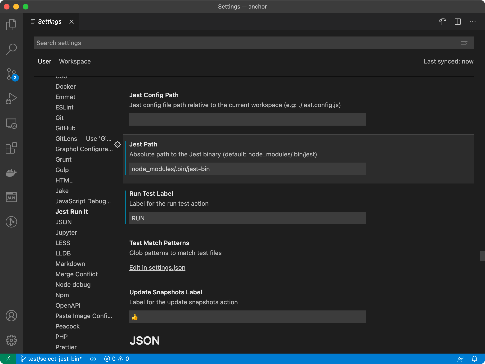
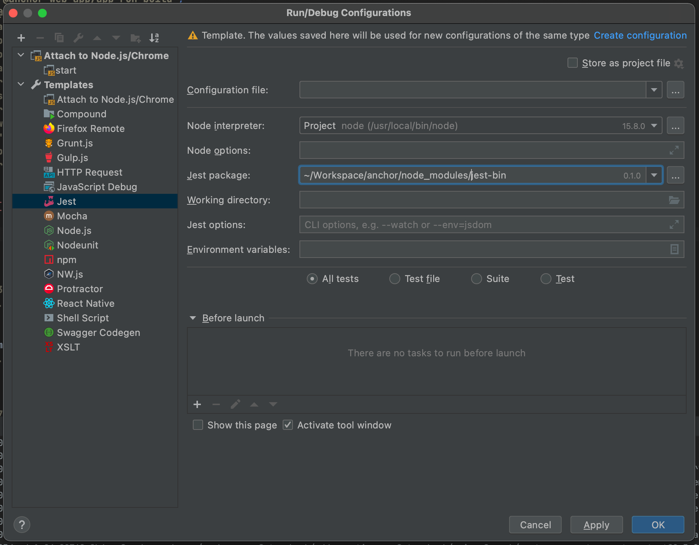

# Find

`jest-bin` command do find and run the appropriate jest bin file among the installed `react-app-rewried`, `react-scripts` and `jest`.

This is useful when running Testcases in VSCode's Jest-Run-It or Webstorm (IntelliJ) environments.

## Configuration for VSCode + Jest Run It

Change the "Jest Path" of "Jest Run It" configuration to `node_modules/.bin/select-jest-bin`

## Configuration for Webstorm (IntelliJ)

Change the "Jest package" of "Jest" Templates configuration to `~/YOUR_PROJECT_ROOT/node_modules/jest-bin`
